# Team Information

Alex McRae (1004926011): alex.mcrae@mail.utoronto.ca

Rahul Jampala (1012502891): rahul.jampala@mail.utoronto.ca

Nathan Le (1012843764): natedw.le@mail.utoronto.ca

Harry Le: harry.le@mail.utoronto.ca

# Motivation

Tournaments are a common way to organize competitions, whether in sports, gaming, classroom activities, or even casual rankings among friends. However, managing brackets and keeping participants updated is often inconvenient. Many available tools restrict access, require mandatory sign-ups, or hide important features behind paid plans. As a result, organizers spend unnecessary time dealing with technical limitations instead of focusing on running the event itself.

The motivation behind Tournament Tracker is to create a simple and open bracket management system that removes these barriers. The platform will allow users to generate brackets quickly, update match results without complexity, and share live progress through a direct link. Viewers should be able to access results without requiring an account.

This project is worth pursuing because it provides a universal solution that can serve different types of competitions. Instead of each event building its own custom system, Tournament Tracker can function as a shared platform that organizers integrate and distribute to participants. Its flexibility also allows it to be used beyond traditional tournaments, such as ranking favourite movies, fictional characters, or other head-to-head comparisons in a structured format.

The primary users of this system include event and league organizers who need a reliable way to manage competitions, as well as friend groups or online communities that want to track informal contests. By focusing on ease of use and accessibility, the platform ensures that both organizers and viewers have a smooth experience.

Although several bracket management tools already exist, they often limit visibility, require payment for advanced features, or restrict public sharing. Tournament Tracker addresses these issues by prioritizing openness, simplicity, and easy sharing, making it practical for a wide range of users and events.

# Objectives

The objective of Tournament Tracker is to design, implement, and deploy a full-stack web application that enables users to create, manage, and share tournament brackets in a scalable and reliable cloud environment. The system must enforce ranking validation rules, persist data securely, and allow real-time updates for viewers.

## Functional Objectives

The main functional objectives for the application are:

- Enable easy creation of tournament brackets.
- Allow flexible bracket editing, such as ranking participants, and setting specific winners for each individual matchup.
- Have results easy to access to anyone with a link.
- Make the design flexible so further tournament customization can be implemented in future iterations.

## System and Architectural Objectives

The main objective with the architecture was to make it modular and have clear separation of concerns between those modules.

The front-end should only be concerned with giving a good user experience and facilitating control to the backend. It should allow for easy to access tournament results, and easy controls to create and edit new tournaments.

The backend should be controlling all the business logic and ensuring consistency in the data being stored and presented to the user through the front-end. Control over what users can access certain functionality, and how to format the data being stored are its main concerns.

The database should hold all of the persistent data in an easy-to-access model.
These modules should also be containerized so that they conform with the general design principles of cloud native applications. This makes deployment to all of the popular cloud-based PaaS apps such as Fly.io seamless.

# Technical Stack

## Front-End Layer

The front-end is implemented as a VITE React app which allows for a simple component-based UI that allows for rapid development that can easily handle user input. It also allows for dynamic rendering for items such as tournament details and all match results.

The front-end handles creating and updating tournaments using a REST API with asynchronous requests to the back-end. Real time updates are facilitated using Websockets.

User authentication is handled through JWT tokens in API requests to ensure users are only allowed to modify tournaments they created.

## Back-End Layer

The back-end is implemented as an express.js application which works well for its intended purpose as a REST API.

It handles the bracket/match creation, match progression, and validation. It also communicates with a PostgreSQL database to store and retrieve all of the persistent data.

Websockets are used to broadcast tournament updates to anybody on the tournament’s details page on the front-end.

## Database Layer

The database layer runs a PostgreSQL relational database to store persistent data such as:

- Users and authentication data
- Tournaments and bracket configurations
- Participants and rankings
- Match results and progression states

The database is implemented using the Prisma ORM in the back-end. This allows the back-end to relate database entities to typescript objects making querying and editing entities much easier. Updates to the database are represented as migrations to have a step-by-step update path for older versions of the database.

## Containerization

Docker is the main technology used to containerize the front-end, back-end and database modules in the application. Docker is the industry-standard containerization technology and allows for simple dependency management, and consistency among different deployments.

Docker Desktop with Docker compose is used for local development to create a multi-container system all at once that are able to communicate with each other.

## Orchestration

Kubernetes run through Minikube is used as the local orchestration platform for the containerized application. This is used locally to simulate how it would work when deploying to Fly.io which handles much of the orchestration logic automatically.

Kubernetes is useful in managing the containerized application since it can:

- Automate deployment and scaling of the containers.
- Self-heal failed pods.
- Load balance to equally run traffic through all functional pods of the same deployment.

## Cloud Deployment

The application was deployed on Fly.io which is a PaaS that allows for global deployment of Docker containers. It also performs similar orchestration logic to Kubernetes where it can have multiple fly machines running the same app and self-heal if one of them breaks.

Fly.io was used for a few different reasons:

- Ease of use.
- Seamless integration with the Docker container architecture.
- Easy monitoring integration.
- Potential for edge computing deployments.
- Reasonable price for development and small deployments.

## CI/CD Pipeline

GitHub Actions was used to automate certain tasks and ensure both reliability and consistency with the main branch and the deployed instance of the application.

For Continuous Integration, whenever a pull request is made in GitHub a few checks are made to ensure the code can be safely pushed to the main branch:

- Both the front-end and back-end apps can be compiled.
- Both the front-end and back-end Docker containers can be created.

For Continuous Delivery, the one automation made was to redeploy the front-end and back-end apps on fly.io every time a commit is pushed to main.

## Real-Time Communication

WebSockets are implemented to maintain persistent connections between clients and the server, enabling automatic updates and synchronization for tournaments when users are on a tournament’s details page.

##

Monitoring and Observability

Monitoring is done through the use of Prometheus and Grafana.

- Scrapes data and sends to prometheus
- Prometheus sends to grafana to display to user.

# User Guide

This section will go through steps on how to properly use the Tournament Tracker application, specifically all core features.

## Creating an account

1. Access the front-end application from whatever deployment option being used.

2. From the home page, click login on the top right corner.

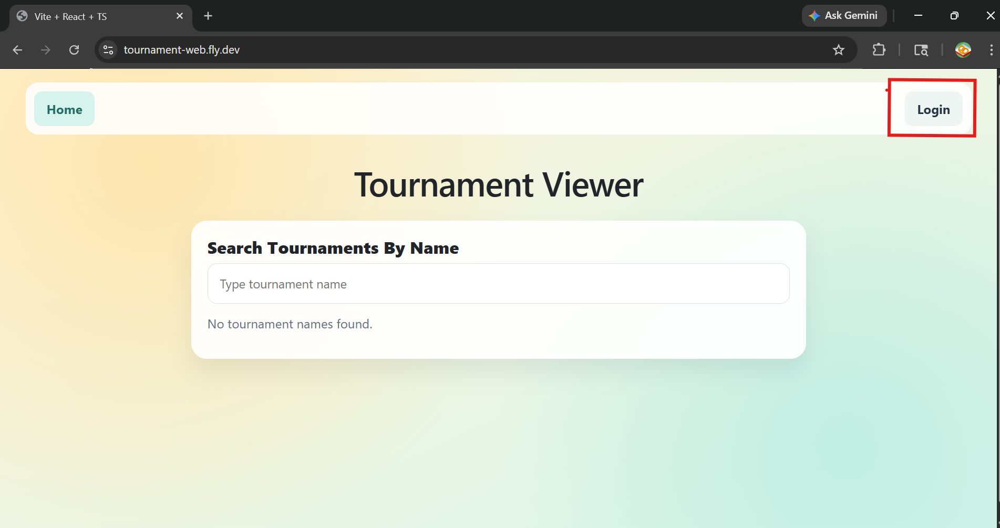

From the login page click the _Don't have an account? Sign Up_ link at the bottom.

Once there enter a username, Email, and password and click _Sign Up_. This should create the account then navigate to the home page again.

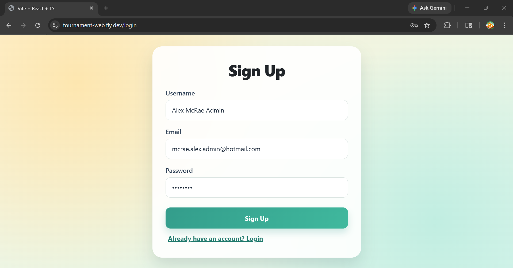

## Creating a Tournament

1. Login to the website, refer to the previous section to create an account.
2. From the home page click the _Open Create Form_ button.

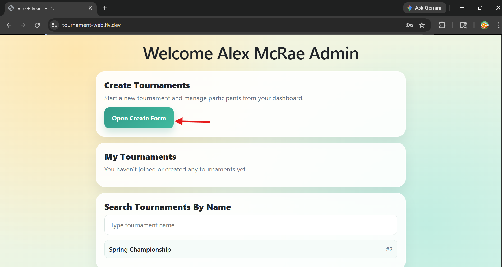

3. From there, enter the name/details of the tournament and click _Create Tournament_.

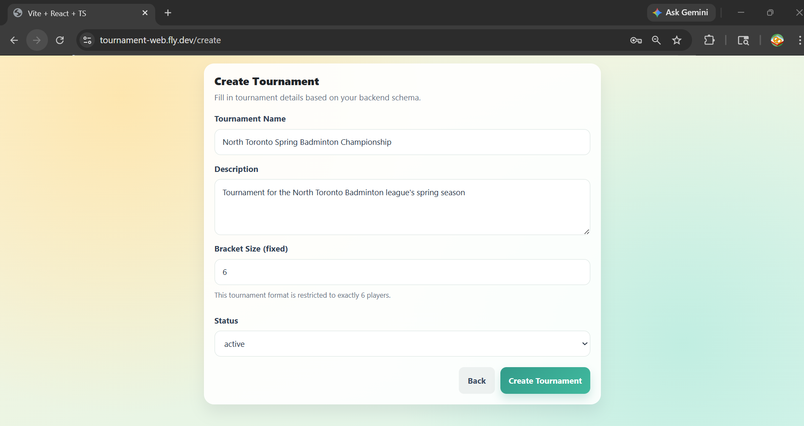

## Viewing Tournament Details

There are a few options to get to the details page of any tournament

1. From the home page search for the tournament in the **Search Tournaments By Name** section. Click the tournament of interest.

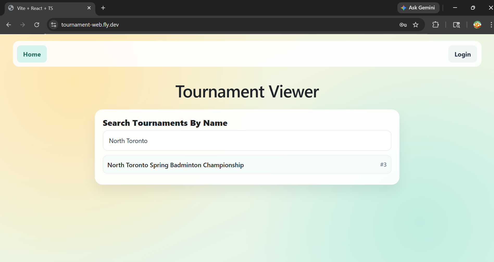

2. If logged in and either the creator or a player in the tournament, find the tournament in the **Search Tournaments By Name** section.

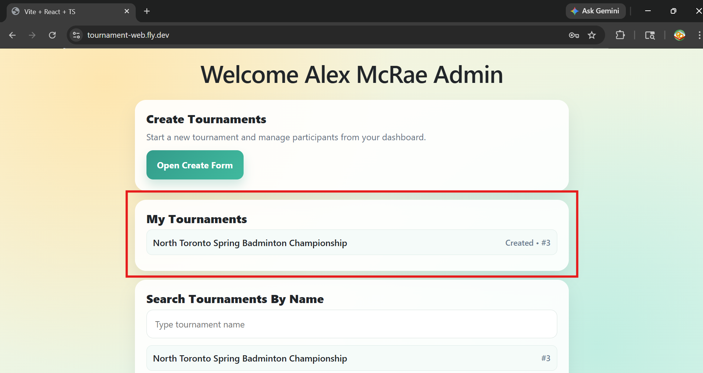

3. Once the tournament is clicked the details page should open:

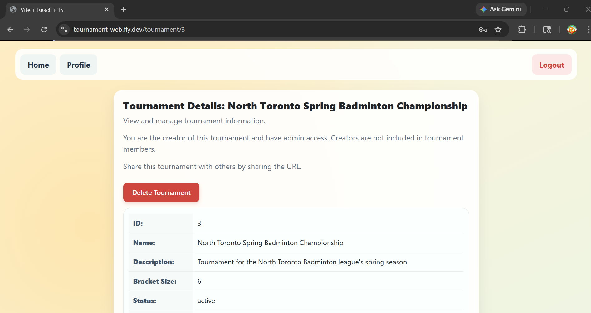

From the tournament details page, the url can be shared with others so that they may have a direct link to this specific tournament's details.

## Joining a Tournament as a Player

To join a tournament as a player:

1. Sign in to an account that did not create the tournament of interest.
2. Go to the tournament details (refer to the previous section for more info on how to get there).
3. From there, if there are fewer than 6 people already in the tournament, an option to join the tournament should appear near the top, and allow you to set a ranking.
4. Click the _Join Tournament_ button.

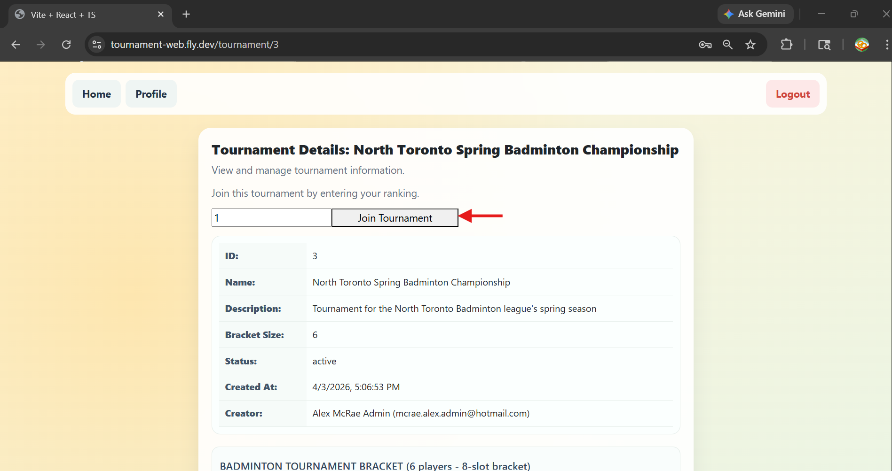

## Editing Tournament Results

Editing tournament results only becomes available once the tournament is filled with 6 players, so make sure to have 6 accounts join.

1. Sign in to the account that created the tournament.
2. Go to the tournament details page for the tournament of interest.
3. The Quarterfinals matchups should be created once entering as the creator.

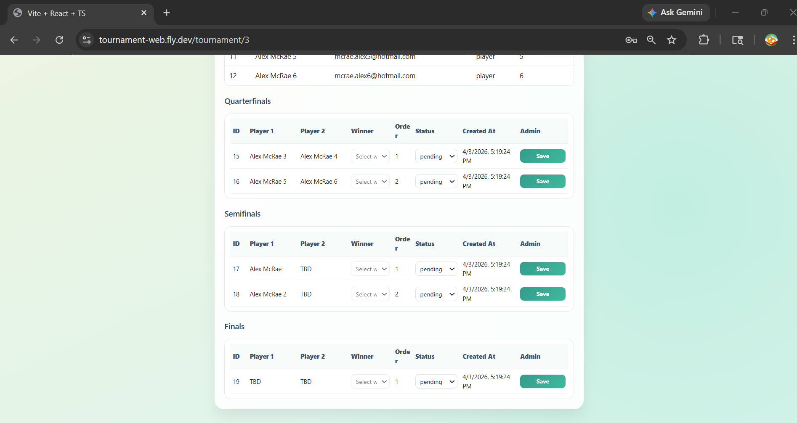

4. For each matchup, set the status to completed, then select a winner from the dropdown.
5. Save each matchup as they are set to persist in the database.

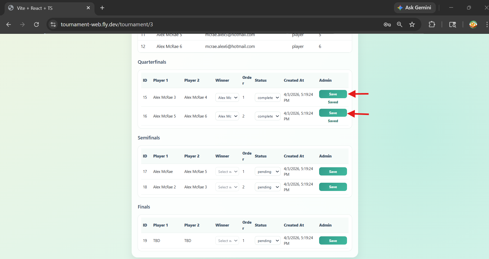

5. Do this for all matchups in the quarterfinal, semifinals, then finals.
6. Once completed a tournament winner should be shown in the bottom of the screen.

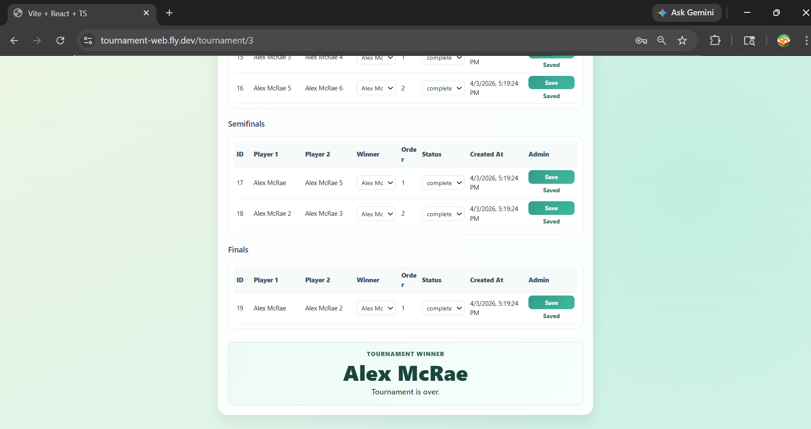

# Development Guide

In order to deploy the Tournament Tracker application, both locally or on fly.io, there are a few steps to make sure the deployment is consistent from everyone with the repository. The complete steps to deploy the app are given in this section.

## Important File Edit

There is an important file in the repository that may cause the front-end web app to sometimes crash immediately upon creation.

```
apps/web/start-nginx.sh
```

For a reason not fully understood, the way to fix this issue is to ensure the file's end of line sequence is set to LF instead of CRLF. Here is where to check if it is correctly set in Visual Studio Code.

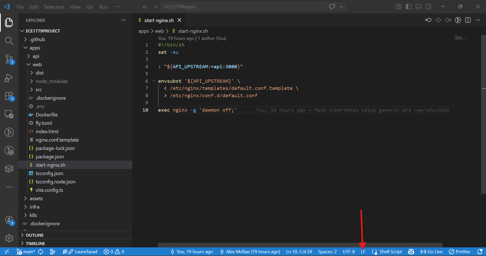

## Important files not in Repository

There are 3 main files that are not in the repository that are needed to deploy the app both locally and on fly.io. All of these files were sent as an email to TA.

1. .env in the root directory. The file location should end up being:

```
ECE1779Project/.env
```

2. .env in the apps/web directory. The file location should end up being:

```
ECE1779Project/apps/web/.env
```

3. secrets.yaml in kubernetes directory. The file location should end up being:

```
ECE1779Project/k8s/secrets.yaml
```

## Installing Dependencies

Before deploying the app anywhere, the dependencies for the app must be installed in order to compile it correctly.

1. Navigate to api app

```
cd apps/api
```

2. Install dependencies

```
npm install
```

3. Navigate to web app

```
cd ../web
```

4. Install dependencies

```
npm install
```

## Docker Compose Deployment (on Docker Desktop)

1. Ensure .env is in root directory of the repository.
2. Ensure the .env in apps/web/ has the VITE_API_URL commented out.
3. Ensure Docker Desktop app is on and fully loaded.
4. From the root directory compose the app containers run Docker compose.

```
docker compose up --build -d
```

5. Wait for deployment to complete
6. Access front-end app from:

```
http://localhost:5172/
```

## Kubernetes Deployment (in Minikube)

1. Initialize Minikube

```
minikube start
```

2. Ensure minikube is running

```
minikube status
```

3. Navigate to api app

```
cd apps/api
```

4. Build docker image of api

```
docker build -t tournament-api-k8s:1.0 .
```

5. Load image in minikube docker daemon

```
minikube image load tournament-api-k8s:1.0
```

6. Navigate to web app

```
cd ../web
```

7. Build docker image of web

```
docker build -t tournament-web-k8s:1.0 .
```

8. Load image in minikube docker daemon

```
minikube image load tournament-web-k8s:1.0
```

9. Navigate to the k8s directory

```
cd ../../k8s
```

10. Ensure secrets.yaml is in there (should have been emailed)

11. Apply all yaml files

```
kubectl apply -f .
```

12. Wait for all pods to be running (api-deployment may show error while db is still being created)

```
kubectl get pods
```

13. Get the url for the web service

```
minikube service web-service --url
```

14. Enter frontend from the given url

15. Once done with testing, ensure minikube is reset

```
minikube delete
```

## Fly.io Deployment

### Create a persistent PostgreSQL app

1. Run the following command.

```
fly postgres create --name {tournament-db} --region yyz
```

2. Select "Development" (Lowest CPU/RAM).
3. Enter “y” to “Scale single node pg to zero after one hour? (y/N).”
4. Wait for app to be created.

### Create the api back-end app

1. Navigate to the api app

```
cd apps/api
```

2. Configure fly.toml.

```
app = '{tournament-api}'
```

3. Initialize the fly app.

```
fly launch --copy-config --no-deploy
```

4. Answer NO to "Tweak settings".
5. Attach db app to api app.

```
fly postgres attach {tournament-db} --app {tournament-api}
```

6. Set JWT Secret (should be given in email).

```
fly secrets set JWT_SECRET={JWT_SECRET} --app {tournament-api}
```

7. Deploy api app.

```
fly deploy --app {tournament-api}
```

8. Wait for app to be deployed.

### Create the web front-end app

1. Navigate to the web app

```
cd ../web
```

2. Configure fly.toml.

```
app = '{tournament-web}'
```

3. Initialize the fly app.

```
fly launch --copy-config --no-deploy
```

4. Answer NO to "Tweak settings".
5. Update VITE_API_URL web .env in apps/web/.env

```
VITE_API_URL=https://{tournament-api}.fly.dev/api/
```

6. Deploy web app.

```
fly deploy --app {tournament-web}
```

7. Wait for app to be deployed.

## Access Fly.io app

The front-end application should then be accessible from

```
https://{tournament-web}.fly.dev
```

# AI Assistance & Verification (Summary)

AI was used in this project for various different purposes. The main use of it was to speed up development on the strict deadline to ensure quality of output.

For example, AI was used during the planning process to help reason what sort of advanced features would be possible to implement in the Tournament Tracker and how feasible they were to implement in the project time-frame.

AI also contributed to the architecture, helping to reason what sort of code structure a cloud based application with multiple individual modules should have in a monolithic repository. This was especially helpful since none of the team members had a lot of experience with developing larger scale cloud applications.

AI was also used to help debug issues occurring during development. For example, issues with standardizing the deployment files such as the compose.yaml for Docker Desktop, the kubernetes .yaml files for minikube deployment, the fly.toml files for fly.io deployment, and the various .env’s that were needed for all of the deployments. Keeping things consistent without having to constantly change environment variables and source code for each deployment strategy was difficult and so AI was used to help configure the deployment to work for all 3 deployment types.

Any code generated by AI was read through and critically analyzed to understand why it implemented a feature in a certain way. The app was also thoroughly tested to ensure there were no gaps in the implemented code. One thing that could have been added given more time were unit tests to ensure consistent output from business critical functions and components in the code. Most of the testing done was functional rather than unit and so that is something that may be further expanded in future projects.

Some mistakes AI generated were caught by the team, for example, there was an issue with deploying on fly.io initially because it would always try to run API requests through the local version of the back-end application instead of the fly.io deployed back-end. AI recommendations suggested including the api url as a fly secret so that it may be seen when compiled. This did not work because the front-end docker container would compile the React app and set the API URL at compile time and not look for the fly secret. To fix this, the API url was added as a .env specific to the front-end that could change for various deployments. This example is shown in further detail in the ai-session.md.

# Individual Contributions

## Alex McRae

- Front-end/back-end architecture.
- Front-end feature implementation.
  - Tournament details page.
  - Running app with and without being logged in.
  - API routing.
- Back-end feature implementation.
  - Initial database structure
  - Controllers.
- CI/CD pipelines.
- Deployment consolidation for Docker Desktop, Kubernetes, and Fly.io.

## Rahul

- Front-end feature implementation.
  - UI design.
  - Tournament creation.
  - Matchup creation.
  - Tournament editing and saving.
  - Authentication/Authorization.
- Back-end feature implementation
  - API endpoints.
  - Prisma ORM setup.
  - Authentication/Authorization.
- Docker Compose setup.

# Lessons Learned and Concluding Remarks

This project was a great learning experience for how real industry apps are developed in a small team. It was evident early on that even though having more people means more work can be done, it also means a lot more planning and collaboration.

Creating clear boundaries between tasks for team-members is difficult, and often one person’s task is blocked until another’s is properly implemented. This is often tough to deal with when everyone has their own schedules and may have other higher priorities at the moment.

It is also evident that a lot of work needs to be put in to even make a simple application functional and complexity in implementation of features can continue to multiply as the project goes on because decisions made a few weeks ago can have large consequences on how certain features can be implemented. Without a lot of time for iteration, compromises need to be made in terms of the final implementation, so that by the final deliverable, it is in a working state.
